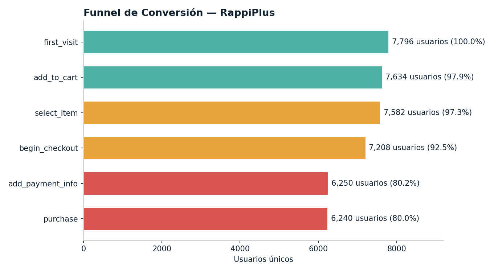
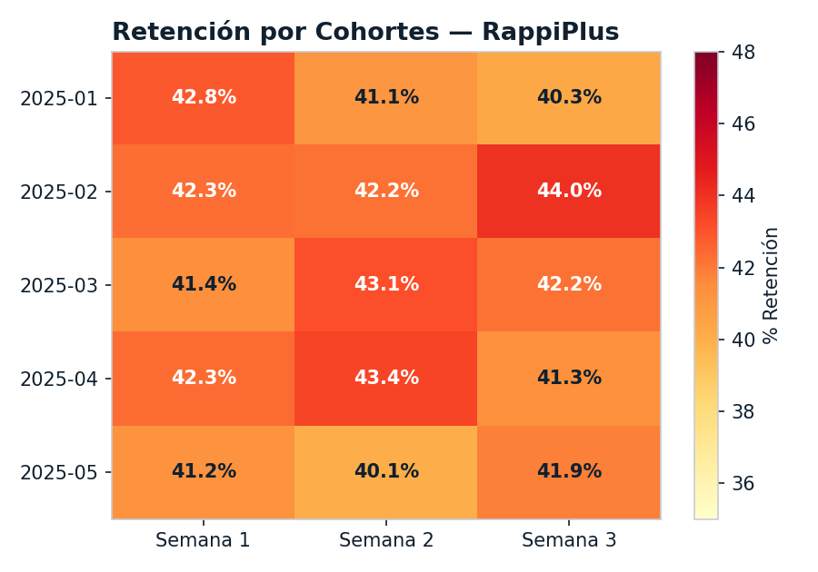
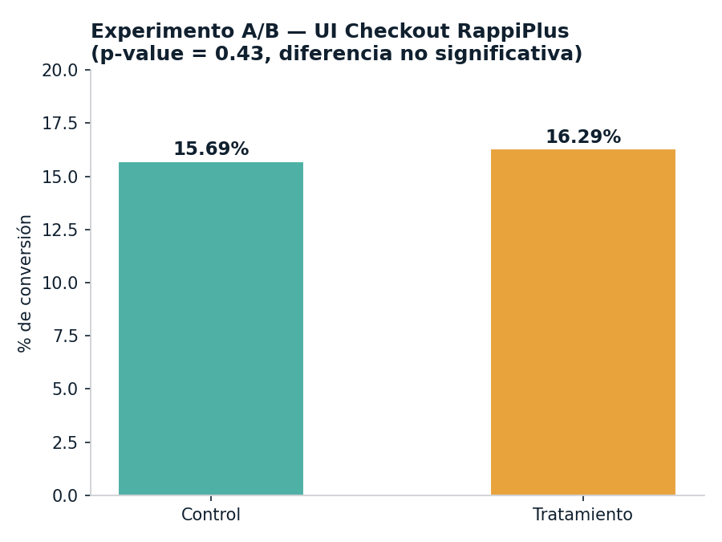

# RappiPlus — De Datos a Decisiones de Negocio

**Autor:** Sergio Alberto Santoyo Ambriz — Certificado de Analista de Datos, TripleTen (2026)
**Stack:** Python (Pandas, NumPy) · SQL (CTEs, Joins) · Power BI / Tableau · Estadística

Proyecto capstone del Certificado de Analista de Datos. Evalúa el desempeño del servicio RappiPlus combinando pedidos, catálogo, marketing, eventos de usuario (SQL) y un experimento A/B, para responder preguntas de negocio sobre rentabilidad, comportamiento de usuario, retención y validación de cambios de producto.

## Preguntas de negocio

- ¿Es rentable el negocio?
- ¿En qué punto del funnel se pierden más usuarios?
- ¿Los usuarios regresan después de registrarse?
- ¿La nueva UI de checkout mejora la conversión?

## Metodología

1. Limpieza y validación de calidad de datos en Python
2. Cálculo de KPIs de rentabilidad (revenue, costo, profit, margen)
3. Construcción del funnel de conversión con SQL
4. Retención por cohortes (semana 1–3)
5. Prueba de hipótesis (chi-cuadrado) sobre el experimento A/B del checkout
6. Dashboard ejecutivo en Power BI / Tableau

## Resultados clave

- **Revenue de $51.95M** con **margen de 11.47%** — negocio rentable
- **Conversión general del 80.04%**; mayor fuga (**12.29%**) entre "iniciar checkout" y "agregar método de pago"
- **Retención estable de ~42%** durante 3 semanas — se recomendaron estrategias de activación temprana
- El cambio de UI (**+0.60% en conversión**) **no fue estadísticamente significativo** (p = 0.43), evitando una decisión de negocio basada en una señal falsa

## Visualizaciones





## Estructura del repositorio

```
├── data/
│   ├── orders_clean.csv
│   ├── catalog_clean.csv
│   └── marketing_clean.csv
├── images/
│   ├── funnel_conversion.png
│   ├── retencion_cohortes.png
│   └── test_ab_checkout.png
├── Proyecto_RappiPlus_de_datos_a_decisiones_de_negocio.xlsx   # Datos consolidados
├── Proyecto_final_Sergio_santoyo.pbix                          # Dashboard interactivo (Power BI)
└── README.md
```

> Nota: el funnel de conversión, la retención por cohortes y el experimento A/B se calcularon originalmente con consultas SQL sobre una base de datos del curso (tablas `events`, `users`, `user_activity`, `experiment_checkout_ui`), no incluida en este repo. Los datasets de `data/` corresponden a la parte de rentabilidad y comportamiento de ventas (Pasos 1-2), que sí son completamente reproducibles con los archivos aquí incluidos.

## Contacto

[LinkedIn](https://www.linkedin.com/in/sergio-alberto-santoyo-ambriz-12b458179) · sergio.santoyo.ambriz@gmail.com
